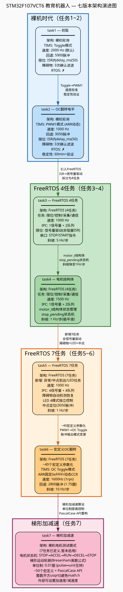
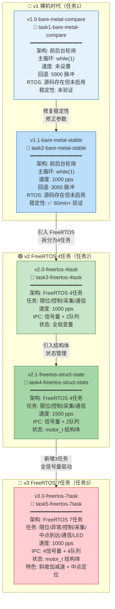
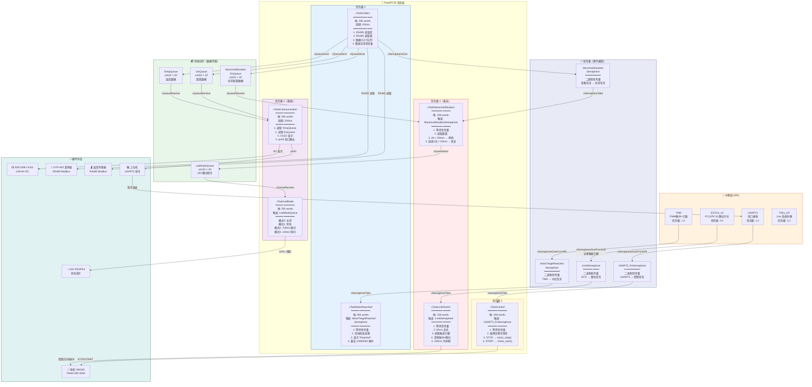
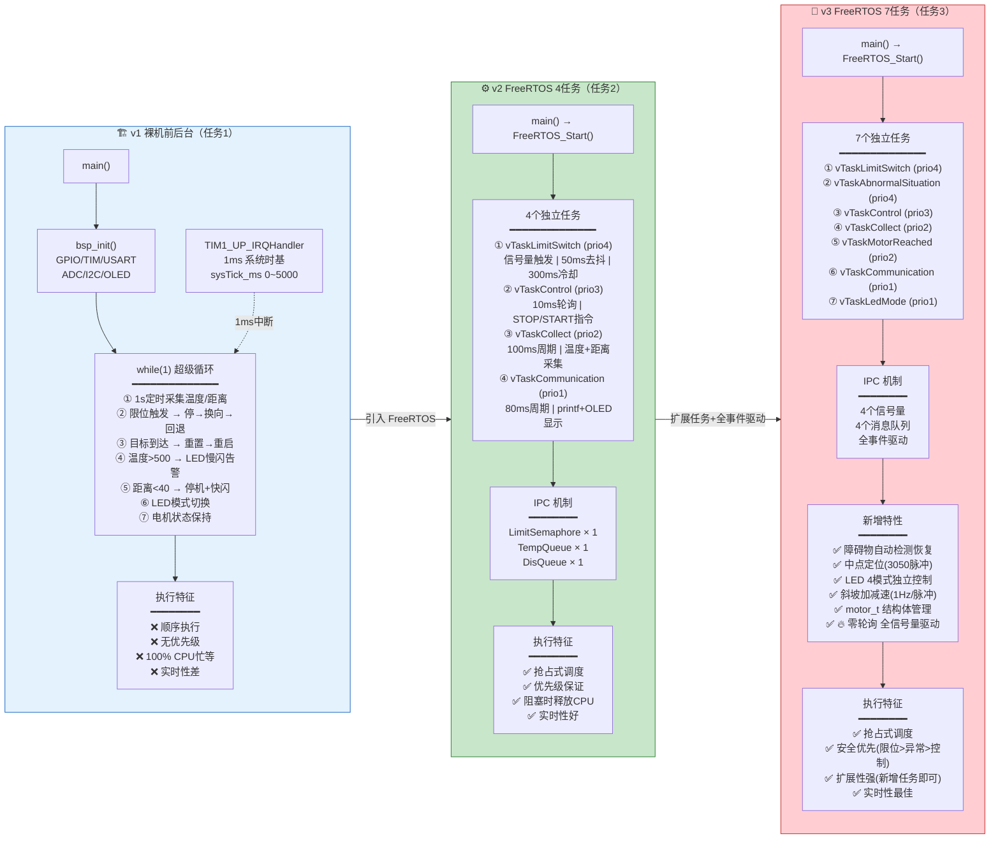
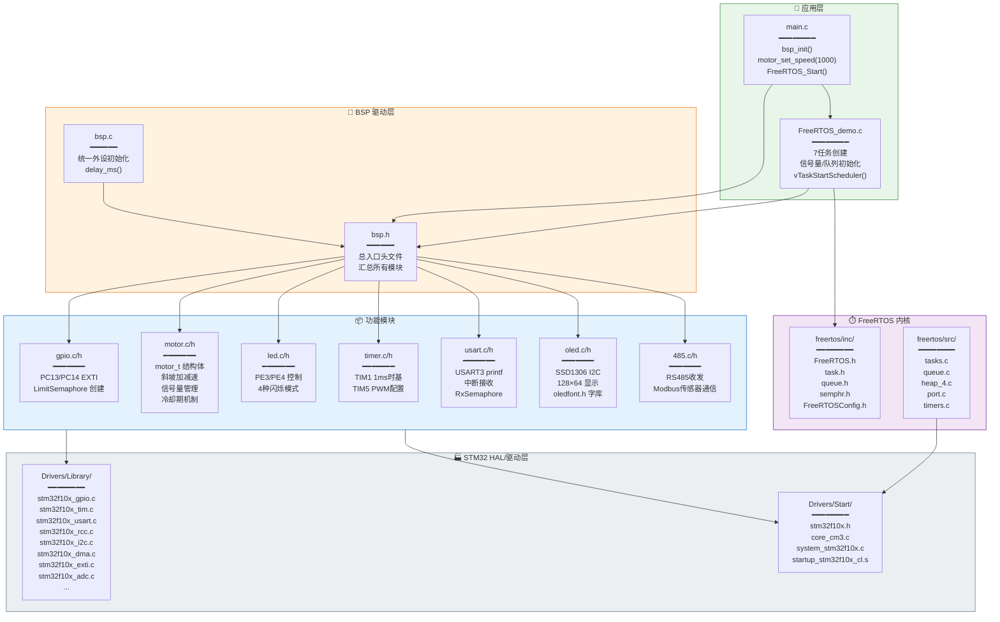
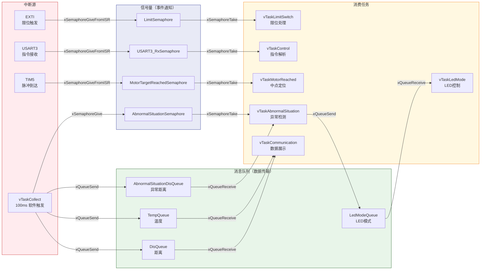

# 项目架构图集

> **STM32F107VCT6 教育机器人控制系统** — 架构可视化
> 生成日期: 2026-06-16
>
> 📁 Mermaid 实时渲染（下方） | 📁 [SVG 下载（Graphviz 渲染）](diagrams/)

---

## 1. 版本架构演进图

---

## 2. 最终版（v3.0）详细任务架构图

---

## 3. 三代架构对比图

---

## 4. 模块依赖关系图（最终版）

---

## 5. IPC 数据流图（最终版）

---

## 6. 任务优先级与触发方式总览

| 任务 | 优先级 | 栈 | 触发方式 | 周期/超时 | 职责 |
|------|:---:|-----|----------|-----------|------|
| vTaskLimitSwitch | 4 | 256W | LimitSemaphore (阻塞) | portMAX_DELAY | 限位响应/换向/冷却 |
| vTaskAbnormalSituation | 4 | 256W | AbnormalSituationSemaphore (阻塞) | portMAX_DELAY | 障碍物检测/自动恢复 |
| vTaskControl | 3 | 256W | USART3_RxSemaphore (阻塞) | portMAX_DELAY | STOP/START 指令 |
| vTaskCollect | 2 | 256W | vTaskDelay 周期延时 | 100ms | 传感器采集/数据分发 |
| vTaskMotorReached | 2 | 256W | MotorTargetReachedSemaphore (阻塞) | portMAX_DELAY | 中点定位(3050脉冲) |
| vTaskCommunication | 1 | 256W | vTaskDelay 周期延时 | 200ms | OLED+printf 输出 |
| vTaskLedMode | 1 | 256W | LedModeQueue (非阻塞) | 0 (立即返回) | 4模式LED控制 |

---

> **作者**: Tom &nbsp;|&nbsp; **项目**: 毕业设计 — 教育机器人控制系统
